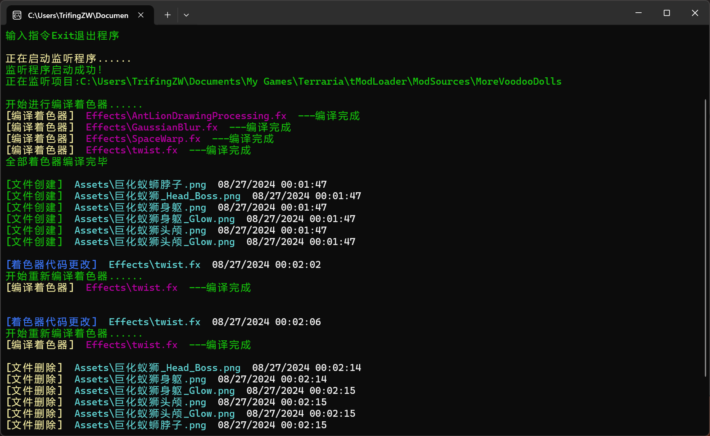
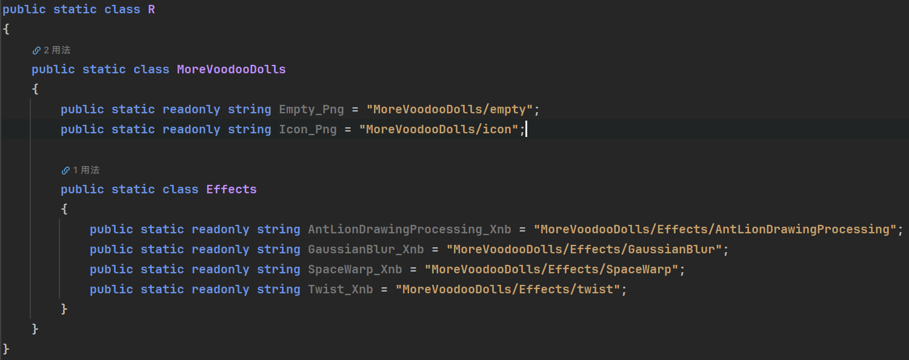

# TModWatcher

<div>
	
    
    
    
</div>


欢迎使用 **TModWatcher**！这款工具由 TrifingZW 开发，旨在帮助你自动生成资源的 C# 引用并编译着色器文件，让你的 Terraria
模组开发更加轻松！

## 工具简介

**TModWatcher** 是一个为 Terraria 模组开发者设计的自动化工具。它通过监控 TModLoader 项目解决方案，自动生成 C#
资源引用，并且在项目更改时自动编译着色器文件。此工具适用于 Windows 操作系统，不需要安装任何额外工具即可使用，极大简化了模组开发流程。




## 功能特点

- **自动生成 C# 资源引用**：根据项目中的资源文件，自动生成相应的 C# 代码引用，避免手动操作的繁琐。
- **自动编译着色器文件**：在资源发生变化时，自动编译 HLSL 着色器文件，确保项目始终使用最新的着色器。
- **实时监控项目文件夹**：实时监控指定的解决方案路径，一旦检测到资源文件变化，立即触发相应的操作。
- **自定义命名方式**：支持蛇形命名法（snake_case），并允许为生成的字段名称添加后缀。

## 安装与使用

**TModWatcher** 无需安装，无需.NET运行时，只需下载并运行可执行文件即可使用。

### 基本使用方法

1. **前往[Releases](https://github.com/ForOne-Club/TModWatcher/releases)下载并解压 TModWatcher**
2. **编辑配置文件**
    - 在解压后的文件夹中找到 `WatcherSettings.json` 文件，编辑该文件以配置工具的行为
    - `WorkPath`：指向 Terraria 模组项目的解决方案路径
    - `ShaderCompile`：指向 FX 着色器编译器的路径，默认为 `ShaderCompile/ShaderCompile.exe`
    - `SnakeCase`：是否启用蛇形命名法，默认为 `true`
    - `GenerateExtension`：是否为生成的字段名称添加后缀，默认为 `true`
    - `ResourcePath`：生成的C#资源引用静态类路径，默认为 `Resource/R.cs`
    - `FileTypes`：需要监控的文件类型，默认为 `[".png", ".jpg", ".webp", ".bmp", ".gif", ".mp3", ".wav", ".ogg", ".flac", ".xnb"]`
    - `IgnorePaths`：需要忽略的文件夹路径，默认为 `[".git", ".idea", ".vs", "bin", "obj", "Properties", "Localization", "Resource"]`
3. **运行命令**：
   ```shell
   TModWatcher SettingsPath=WatcherSettings.json
   ```
    - `SettingsPath=path`：指向配置文件，默认为相对路径`WatcherSettings.json`

### 示例

假设您的项目路径为 `C:\Projects\MyTerrariaMod` 请先编辑配置文件 `WatcherSettings.json` ,将 `WorkPath` 设置为 `C:\Projects\MyTerrariaMod` 然后运行命令

```shell
TModWatcher SettingsPath=WatcherSettings.json
```

## 项目地址与支持

**TModWatcher** 隶属于 [万物一心](https://github.com/ForOne-Club) 团队，这是一个致力于 Terraria 模组开发的团队。

<div align="center">
   
</div>

如果你有任何问题，欢迎加入我们的 **QQ群**：574904188 或者联系开发者 **QQ**：3077446541。

你也可以访问开发者的 GitHub 主页：https://github.com/TrifingZW 获取更多信息。

## 开源协议

**TModWatcher** 基于 MIT 开源协议发布，请自觉遵守协议规则。

---

感谢您使用 **TModWatcher**，祝您在 Terraria 模组开发中一切顺利！
